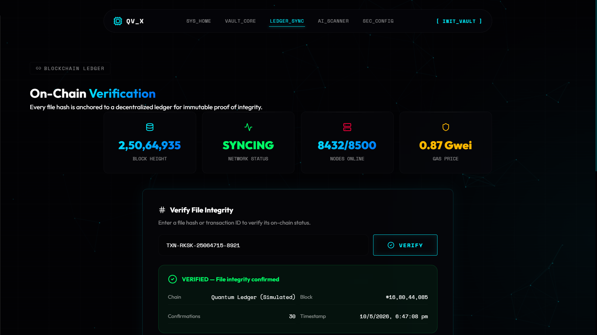
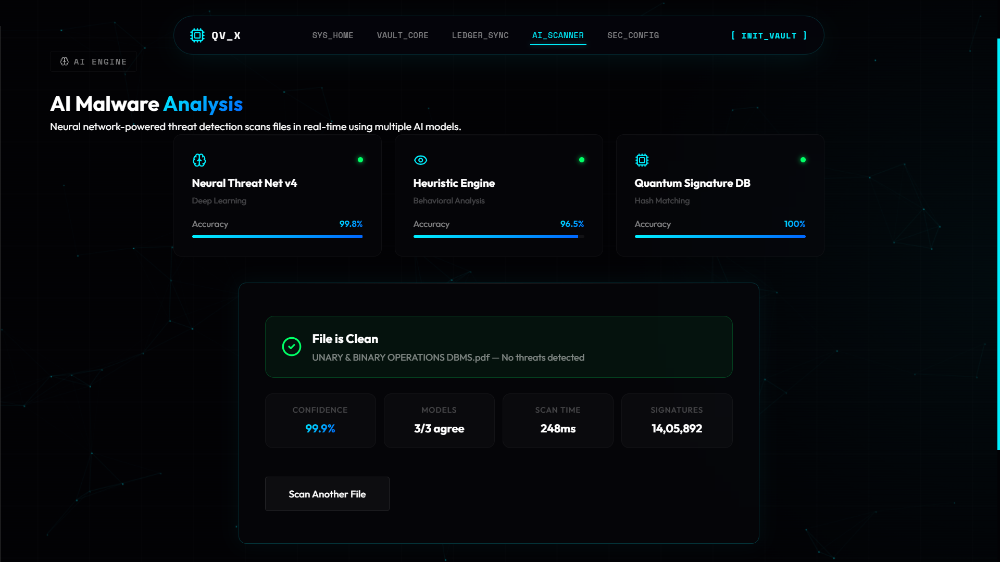

# 🔐 QuantumVault-X

QuantumVault-X is a futuristic cybersecurity and decentralized storage platform designed for secure file protection, blockchain verification, and AI-powered threat analysis.

---

## 🚀 Features

- 🔒 AES-256-GCM File Encryption
- ⛓️ Blockchain Integrity Verification
- 🧠 AI Malware Scanner
- 📂 Secure Vault Storage
- 📊 Real-Time Ledger Synchronization
- 🌐 Ethereum Mainnet Integration
- ⚡ Cyberpunk Inspired UI/UX
- 🛡️ SHA-256 File Fingerprinting

---

## 🛠️ Tech Stack

### Frontend
- React.js
- Framer Motion
- Lucide Icons

### Backend
- Node.js
- Express.js

### Blockchain
- Ethers.js
- Ethereum Mainnet
- BlastAPI

### Security
- Native Node.js Crypto Library
- AES-256-GCM Encryption

---

## ⚙️ How It Works

### Vault Core
Files are encrypted using AES-256-GCM and assigned a SHA-256 hash fingerprint.

### Ledger Sync
The hash is verified using the internal ledger and Ethereum blockchain.

### AI Scanner
Files are analyzed for malware signatures and suspicious entropy patterns.

---

## 📸 Screenshots

### Dashboard
.png)

### Ledger Verification


### AI Scanner


---

## ▶️ Running the Project

### Backend

```bash
cd backend
node server.js
```

### Frontend

```bash
npm run dev
```

---

## 🔐 Security Notes

- Sensitive credentials are protected using `.env`
- API keys are excluded using `.gitignore`
- Encryption keys are never exposed publicly

---

## 🌌 Future Enhancements

- Smart Contract Deployment
- IPFS Decentralized Storage
- Quantum Resistant Encryption
- Real-Time Threat Intelligence
- Multi-User Vault Access

---

## 👩‍💻 Developer

Harini P  
B.E IoT & Cyber Security with Blockchain Technology  
DSCE, Bangalore

Passionate about:
- IoT
- Cyber Security
- Blockchain
- Smart Systems
- Real-Time Security Platforms
